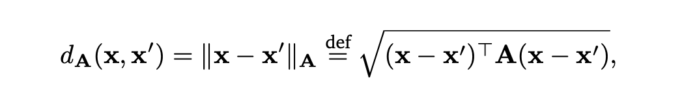

# Siamese Networks for One-short Learning

The most widely used similary metric for comparing two feature vectors are Euclidean Distance and Cosine similarity. However, this selection is arbitrary. In practice, a metric can work better on one dataset but worse  on another dataset, and actually we can customize a metric, and integrate it into learning algorithms like K-NN. However, it's still very difficult to know which equation will work best for a dataset. The solution is we can learn the metric from the data and we call this process  metric learning.   
Let say x1 and x2 are two feature vectors, 
  d(x1, x2) = sqrt((x1-x2)(x1-x2))

We can rewrite this equation to make it parametrizable:

where A is a D x D matrix. If A is a identity matrix, the equation becomes the common Eucledian metric. If A is a normal diagnal matrix, values in the diagnal represents the importance of each dimension of the feature vectors in the metric calculation.

One shot learning is actually a metric learning problem where we want to learn a similarity metric to classify objects of a target class while there is only one or a few examples (target class) are avaiable
One of an applications of the one shot learning is a facial recognition system for a comapny to ensure only its employees can access the company's building or to monitor the employee's schedules. An other example is fraud detection.

The problem with one shot learning is the significant skewness in the available data for training between the postive and negative classes, which cannot be resolved by common deep learning techniques that require a large amount of training data. [Koch et al.](https://www.cs.cmu.edu/~rsalakhu/papers/oneshot1.pdf) has addressed this problem using Siamese Network and a binary crossentropy loss for image classification. This repository will try to implement the approach proposed in the paper with Tensorflow 2 and Omniglot Dataset. The domain targeted in the paper is image recognition. If we want to learn a metric, [triplet loss](https://omoindrot.github.io/triplet-loss) should be used instead.

Details of the approach can be found in the [paper](https://www.cs.cmu.edu/~rsalakhu/papers/oneshot1.pdf). I just briefly describe the siamese Network for the completeness of a README file.

## Siamese Network

Siamese Network is network that is comprised of twin networks tied by weights. Each network will try to learn the encodings of examples. The end of the two networks are joined by an energy funtion. This function computes some metric between the two encodings on each side. This is why one shot learning can also be formulated as a metric learning problem.  

Below is the architecture of the siamese network implemented by Koch et al. We also follow this architecture for the Omniglot dataset.
